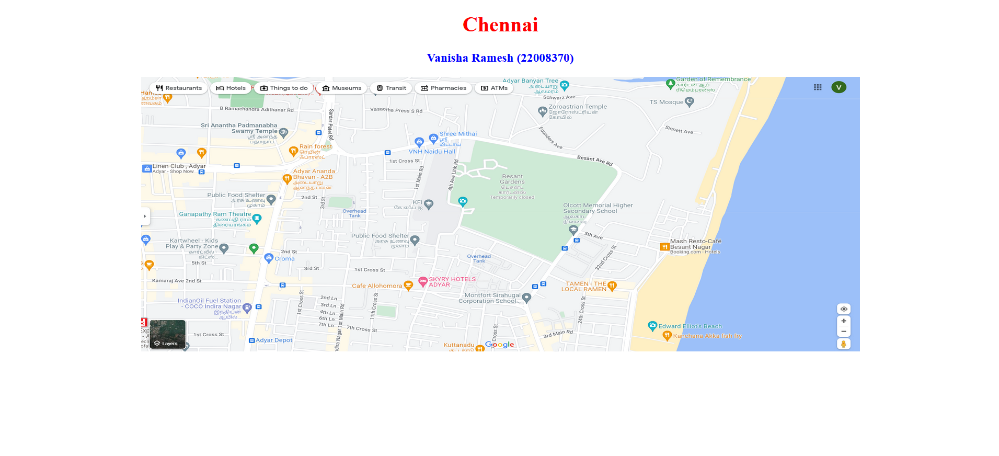
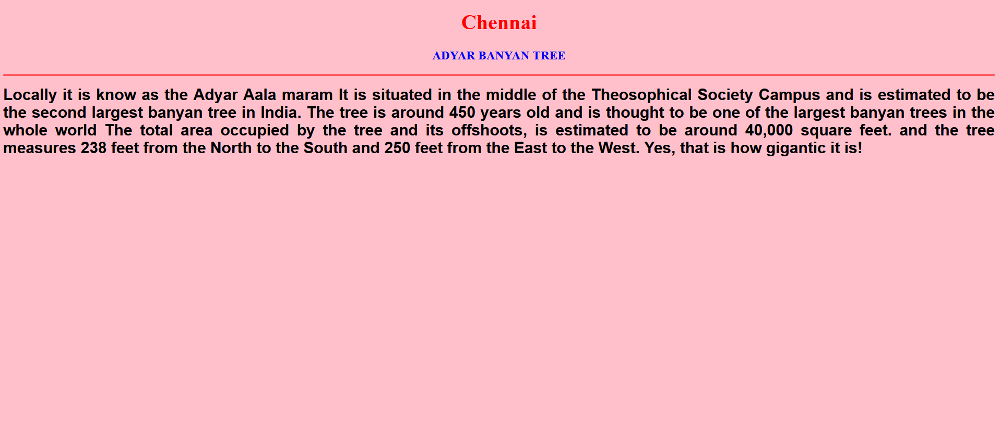
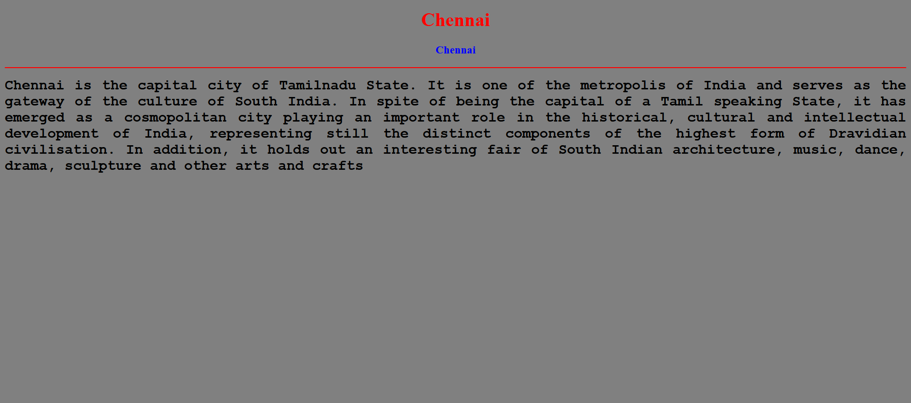
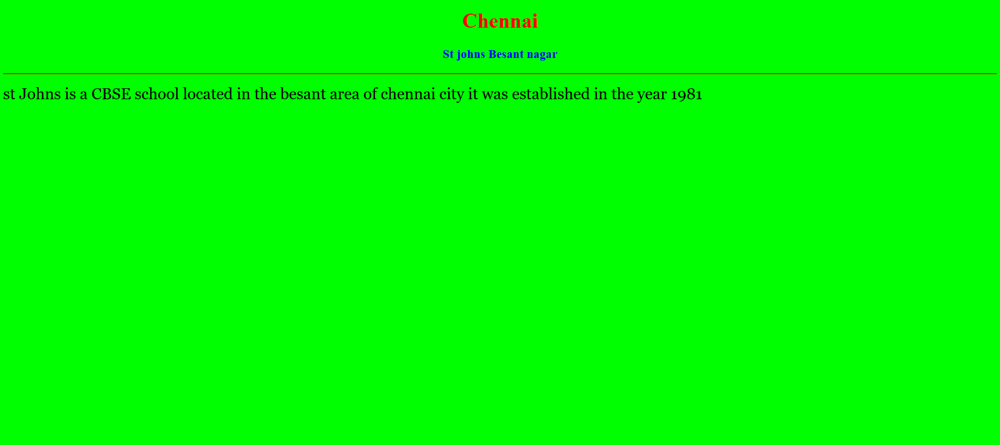
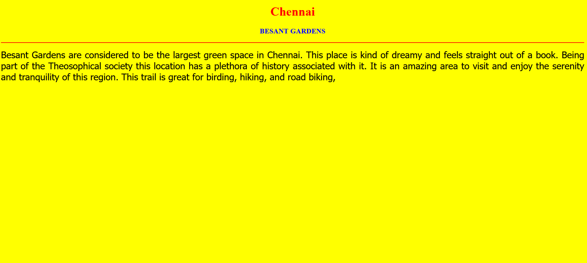
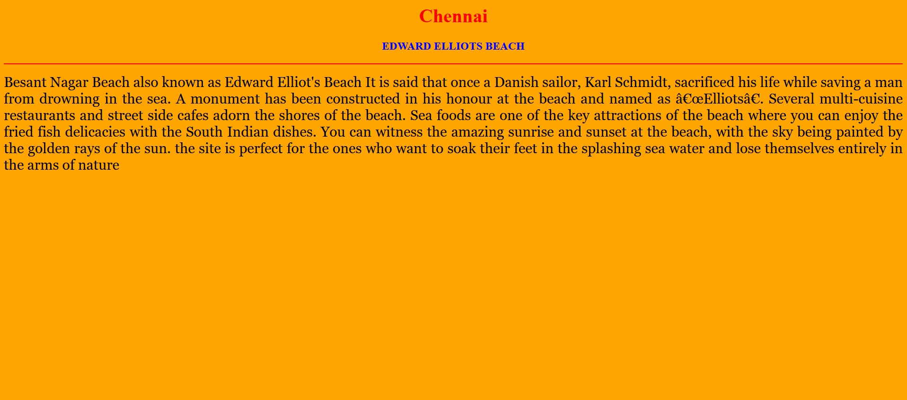
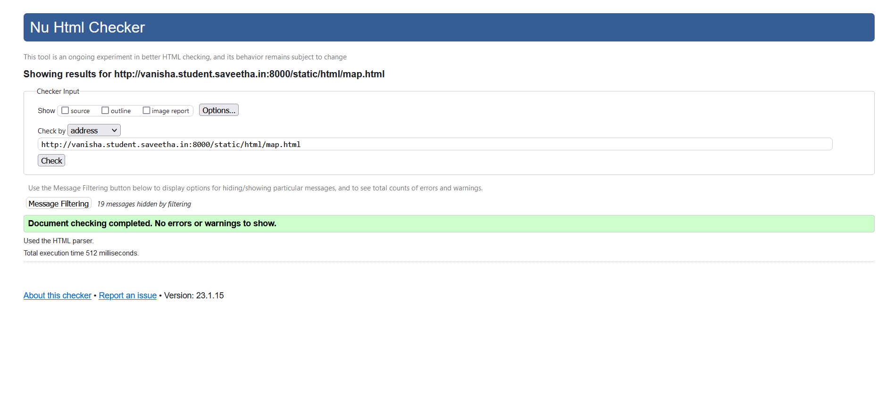

# Places Around Me
## AIM:
To develop a website to display details about the places around my house.

## Design Steps:

### Step 1:
clone the github repository into Theia IDE

### Step 2:
Create a new django project

### Step 3:
Write the neded HTML code.

### Step 4:
Run the Django server and execute the HTML files.

## Code:
```
map.html
<!DOCTYPE html>
<html lang="en">
<head>
<title>My City</title>
</head>
<body>
<h1 align="center">
<font color="red"><b>Chennai</b></font>
</h1>
<h3 align="center">
<font color="blue"><b>Vanisha Ramesh (22008370)</b></font>
</h3>
<center>

<map name="MyCity">
<area shape="circle" coords="13.010429811201014, 80.26770438550629" href="/static/html/abt.html" title="ADYAR BANYAN TREE">
<area shape="rectangle" coords="12.9989° N, 80.2718° E" href="/static/html/eeb.html" title="EDWARD ELLIOTS BEACH">
<area shape="circle" coords="13.002169502878296, 80.26775983729951" href="/static/html/sjbn.html" title="ST JOHNS SCHOOL">
<area shape="circle" coords="13.001045660992647, 80.26149919074435" href="/static/html/cafe.html" title="CAFE ALLOHOMORA">
<area shape="rectangle" coords="13.006002,80.26626" href="/static/html/bg.html" title="BESANT GARDENS">
</map>
</center>
</body>
</html>

eeb.html
<!DOCTYPE html>
<html lang="en">
<head>
<title>EDWARD ELLIOTS BEACH</title>
</head>
<body bgcolor="orange">
<h1 align="center">
<font color="red"><b>Chennai</b></font>
</h1>
<h3 align="center">
<font color="blue"><b>EDWARD ELLIOTS BEACH</b></font>
</h3>
<hr size="3" color="red">
<p align="justify">
<font face="Georgia" size="5">
Besant Nagar Beach also known as Edward Elliot's Beach
It is said that once a Danish sailor, Karl Schmidt, sacrificed his life while saving a man from drowning in the sea. 
A monument has been constructed in his honour at the beach and named as “Elliots”.
Several multi-cuisine restaurants and street side cafes adorn the shores of the beach.
Sea foods are one of the key attractions of the beach where you can enjoy the fried fish delicacies with the South Indian dishes.
You can witness the amazing sunrise and sunset at the beach, with the sky being painted by the golden rays of the sun.
the site is perfect for the ones who want to soak their feet in the splashing sea water 
and lose themselves entirely in the arms of nature
</font>
</p>
</body>
</html>

bg.html
<!DOCTYPE html>
<html lang="en">
<head>
<title>BESANT GARDENS</title>
</head>
<body bgcolor="yellow">
<h1 align="center">
<font color="red"><b>Chennai</b></font>
</h1>
<h3 align="center">
<font color="blue"><b>BESANT GARDENS</b></font>
</h3>
<hr size="3" color="red">
<p align="justify">
<font face="Tahoma" size="5">
Besant Gardens are considered to be the largest green space in Chennai.
This place is kind of dreamy and feels straight out of a book.
Being part of the Theosophical society this location has a plethora of history associated with it.
It is an amazing area to visit and enjoy the serenity and tranquility of this region. 
This trail is great for birding, hiking, and road biking, 
</font>
</p>
</body>
</html>

sjbn.html
<!DOCTYPE html>
<html lang="en">
<head>
<title>ST JOHNS SCHOOL</title>
</head>
<body bgcolor="lime">
<h1 align="center">
<font color="red"><b>Chennai</b></font>
</h1>
<h3 align="center">
<font color="blue"><b>St johns Besant nagar</b></font>
</h3>
<hr size="3" color="red">
<p align="justify">
<font face="Georgia" size="5">
st Johns is a CBSE school located in the besant area of chennai city
it was established in the year 1981
</font>
</p>
</body>
</html>

abt.html
<!DOCTYPE html>
<html lang="en">
<head>
<title>ADYAR BANYAN TREE</title>
</head>
<body bgcolor="pink">
<h1 align="center">
<font color="red"><b>Chennai</b></font>
</h1>
<h3 align="center">
<font color="blue"><b>ADYAR BANYAN TREE</b></font>
</h3>
<hr size="3" color="red">
<p align="justify">
<font face="Arial" size="5">
<b>
Locally it is know as the Adyar Aala maram 
It is situated in the middle of the Theosophical Society Campus and is estimated to be the second largest banyan tree in India.
The tree is around 450 years old and is thought to be one of the largest banyan trees in the whole world
The total area occupied by the tree and its offshoots, is estimated to be around 40,000 square feet.
and the tree measures 238 feet from the North to the South and 250 feet from the East to the West.
Yes, that is how gigantic it is!
</b>
</font>
</p>
</body>
</html>

cafe.html
<!DOCTYPE html>
<html lang="en">
<head>
<title>CAFE ALLOHOMORA</title>
</head>
<body bgcolor="gray">
<h1 align="center">
<font color="red"><b>Chennai</b></font>
</h1>
<h3 align="center">
<font color="blue"><b>Chennai</b></font>
</h3>
<hr size="3" color="red">
<p align="justify">
<font face="Courier New" size="5">
<b>
Chennai is the capital city of Tamilnadu State.
It is one of the metropolis of India and serves as the gateway of  the  culture  of South India.
In spite of being the  capital  of  a  Tamil speaking  State, 
it has emerged as a cosmopolitan city playing  an  important role  in  the  historical, cultural and  intellectual  development  of  India,
representing  still the distinct components of the highest form  of  Dravidian civilisation.
In addition, it holds out an interesting fair of  South Indian architecture, music, dance, drama, sculpture and other arts and crafts
</b>
</font>
</p>
</body>
</html>
```

## Output:












# HTML Validator


## Result:
The program for implementing image map is executed sucessfully